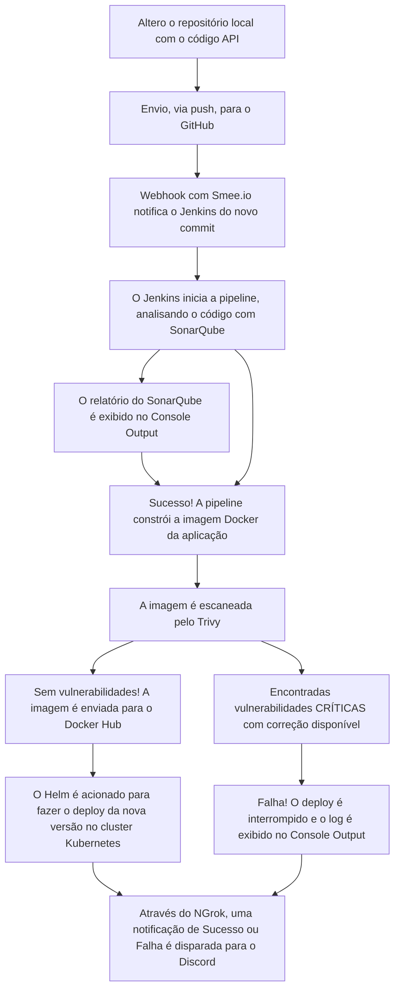
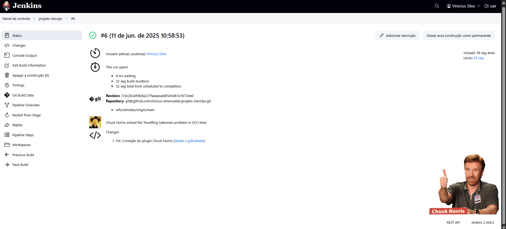
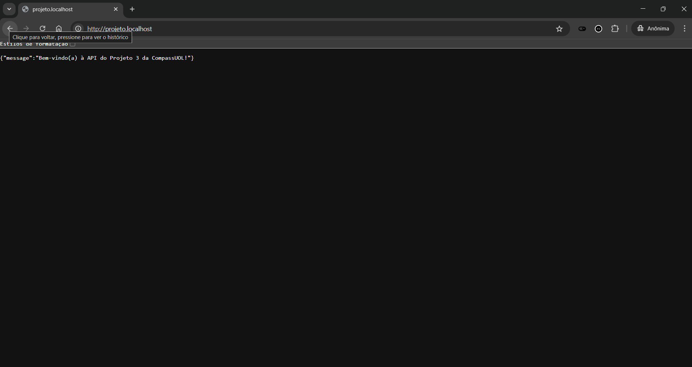
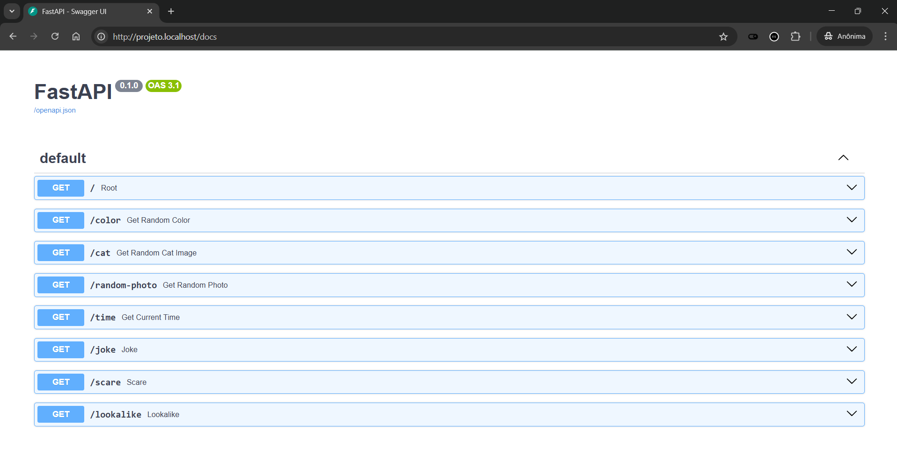
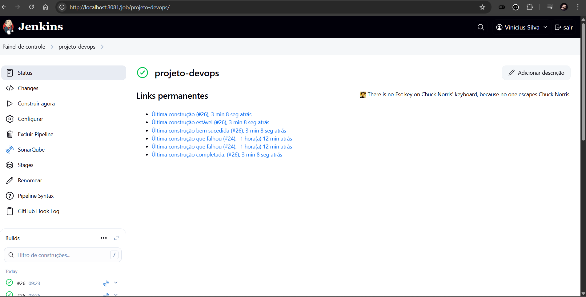
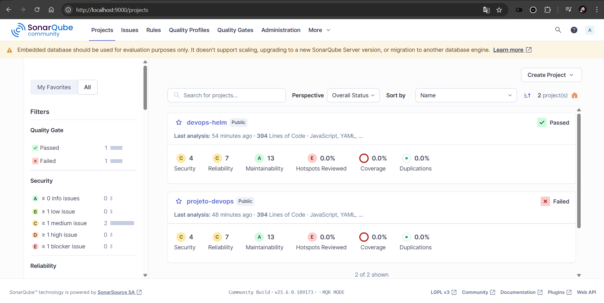
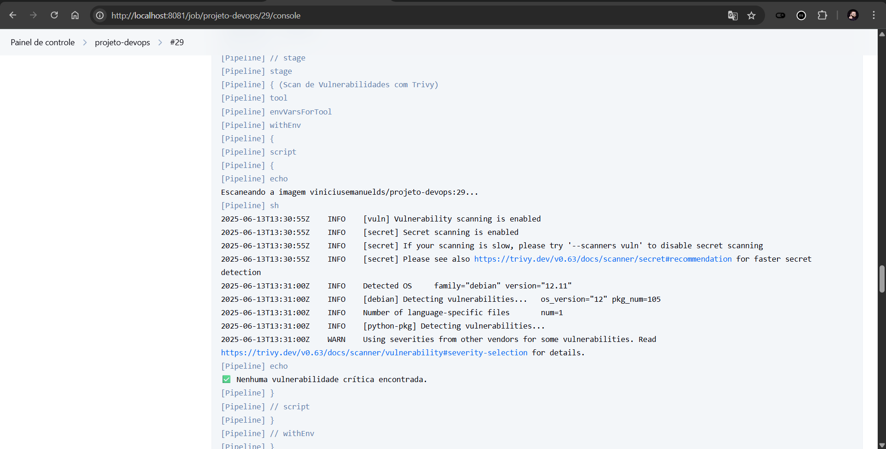
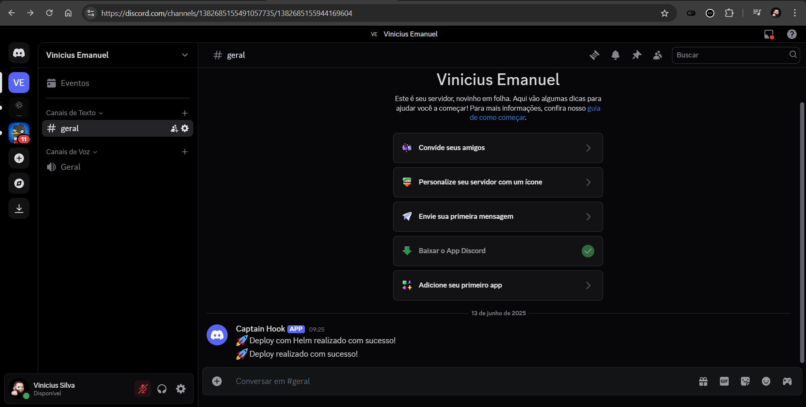
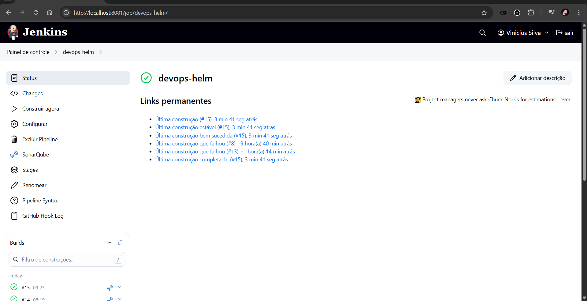
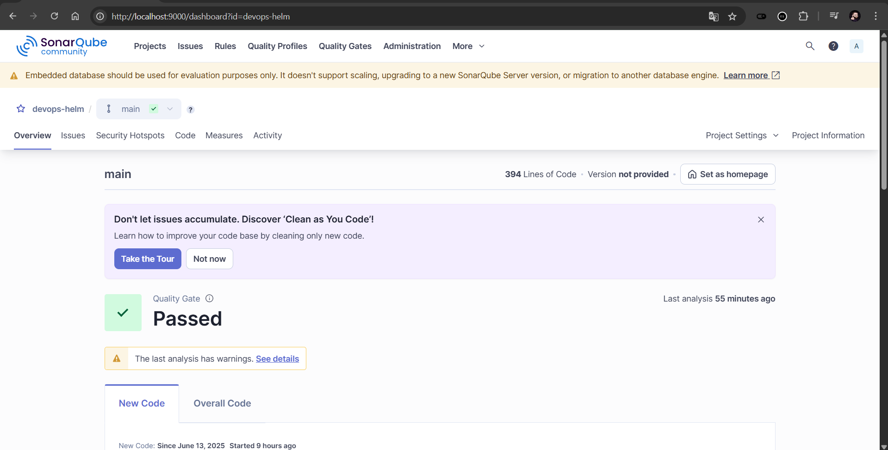

# ♾️Projeto DevOps: Guia Definitivo de uma Pipeline CI/CD Completa

Este repositório é a documentação da minha jornada construindo uma esteira de Integração e Entrega Contínua (CI/CD) do zero.

Minha intenção aqui foi ir além de um simples "como fazer". Este é um guia detalhado que explora não apenas o "o quê", mas o "porquê" de cada ferramenta, cada comando e cada decisão de arquitetura. O objetivo de uma pipeline CI/CD é criar uma ponte automatizada, segura e eficiente entre o código e o usuário final, e cada linha deste projeto foi pensada para entender e dominar esse fluxo.

## Navegação
- [♾️Projeto DevOps: Guia Definitivo de uma Pipeline CI/CD Completa](#️projeto-devops-guia-definitivo-de-uma-pipeline-cicd-completa)
  - [Navegação](#navegação)
  - [Visão Geral e Arquitetura](#visão-geral-e-arquitetura)
  - [Fase 1: Preparação do Ambiente de Desenvolvimento](#fase-1-preparação-do-ambiente-de-desenvolvimento)
  - [Fase 2: Containerização com Docker](#fase-2-containerização-com-docker)
    - [Dockerfile](#dockerfile)
    - [`.dockerignore`](#dockerignore)
    - [Construindo e Publicando a Imagem](#construindo-e-publicando-a-imagem)
  - [Fase 3: Deploy Manual no Kubernetes](#fase-3-deploy-manual-no-kubernetes)
    - [A Arquitetura do Deploy](#a-arquitetura-do-deploy)
  - [Fase 4: Automação CI/CD com Jenkins](#fase-4-automação-cicd-com-jenkins)
    - [Jenkinsfile](#jenkinsfile)
      - [Configuração do Jenkins](#configuração-do-jenkins)
    - [Jenkinsfile Detalhado](#jenkinsfile-detalhado)
- [Desafios Extras: Construindo uma Pipeline de Nível Profissional](#desafios-extras-construindo-uma-pipeline-de-nível-profissional)
  - [DevSecOps 1: Análise Estática de Código (SAST) com SonarQube](#devsecops-1-análise-estática-de-código-sast-com-sonarqube)
  - [DevSecOps 2: Análise de Vulnerabilidades com Trivy](#devsecops-2-análise-de-vulnerabilidades-com-trivy)
  - [Automação do Fluxo: Webhooks para GitHub (com Smee.io) e Notificações no Discord](#automação-do-fluxo-webhooks-para-github-com-smeeio-e-notificações-no-discord)
  - [Gerenciamento Avançado com Helm](#gerenciamento-avançado-com-helm)
- [NOTA: Pipelines disponíveis neste repositório](#nota-pipelines-disponíveis-neste-repositório)
- [Conclusão e Principais Aprendizados](#conclusão-e-principais-aprendizados)

<br>

---

## Visão Geral e Arquitetura
Este projeto automatiza o deploy de uma API. A seguir, detalho as ferramentas escolhidas e o porquê de cada uma.

| Ferramenta                | Finalidade                                                                                                                                                                                                                                    | Documentação Oficial                                 |
| :------------------------ | :----------------------------------------------------------------------------------------------------------------------------------------------------------------------------------------------------------------------------------------------------------------------- | :----------------------------------------------------- |
| **FastAPI**         | Framework Python para construir a API.                                              | [fastapi.tiangolo.com](https://fastapi.tiangolo.com/)     |
| **Docker**          | Para criar, gerenciar e distribuir a aplicação em containers.                                                                 | [docs.docker.com](https://docs.docker.com/)               |
| **Docker Hub**      | Registro público para armazenar as imagens Docker.                                                                                             | [hub.docker.com](https://hub.docker.com/)                 |
| **Kubernetes**      | Orquestrador de containers para gerenciar a aplicação em um ambiente robusto.                                             | [kubernetes.io/docs](https://kubernetes.io/docs/home/)    |
| **Rancher Desktop** | Para rodar um cluster Kubernetes localmente. | [docs.rancherdesktop.io](https://docs.rancherdesktop.io/) |
| **Jenkins**         | Ferramenta de automação para orquestrar a pipeline de CI/CD.                                                    | [www.jenkins.io/doc/](https://www.jenkins.io/doc/)        |
| **Helm**            | Gerenciador de pacotes para o Kubernetes.                                                                                  | [helm.sh/docs](https://helm.sh/docs/)                     |

O fluxo de trabalho automatizado (pipeline) que construí segue os seguintes passos:



[⬆️ Voltar ao menu](#navegação)

<br>

---


## Fase 1: Preparação do Ambiente de Desenvolvimento

A base de qualquer projeto de automação é um ambiente local funcional e bem configurado.

1. **Código e Versionamento**: riei um repositório no GitHub. O Git é o pilar de qualquer projeto de software moderno, e ter um repositório central é o ponto de partida para a colaboração e automação.
2. **Validação Local da API**: Para garantir que a aplicação funcionava, executei os seguintes passos:

   ```bash
   cd backend

   python -m venv venv

   source venv/bin/activate

   pip install -r requirements.txt

   uvicorn main:app --reload
   ```

   Com a API rodando e acessível em `http:/localhost:8000/docs`, vamos prosseguir.


[⬆️ Voltar ao menu](#navegação)

<br>

---


## Fase 2: Containerização com Docker

O objetivo aqui era empacotar a aplicação em uma imagem Docker, tornando-a portátil e isolada.

### Dockerfile

O `Dockerfile` é um script que contém as instruções para montar a imagem da nossa aplicação, camada por camada.

```dockerfile
# /backend/Dockerfile

FROM python:3.9-slim

WORKDIR /app

COPY requirements.txt .

RUN apt-get update && apt-get upgrade -y && apt-get clean && \
    pip install --no-cache-dir -r requirements.txt

COPY . .

CMD ["uvicorn", "main:app", "--host", "0.0.0.0", "--port", "8000"]
```

### `.dockerignore`

Para evitar que arquivos desnecessários (como ambientes virtuais, cache do Python ou o próprio diretório `.git`) fossem copiados para a imagem, criei um arquivo `.dockerignore`. Isso mantém a imagem final limpa, pequena e acelera o processo de build.

```dockerignore
__pycache__/
*.pyc
.git
.venv
*.md
```

### Construindo e Publicando a Imagem

Com os arquivos prontos, executei os seguintes comandos:

```bash
docker build -t viniciusemanuelds/projeto-devops:latest .

docker push viniciusemanuelds/projeto-devops:latest
```


[⬆️ Voltar ao menu](#navegação)

<br>

---


## Fase 3: Deploy Manual no Kubernetes

Com a imagem no Docker Hub, era hora de implantá-la no cluster Kubernetes. Fazer isso manualmente foi fundamental para entender os objetos principais do K8s.

### A Arquitetura do Deploy

O fluxo de uma requisição até a aplicação dentro do Kubernetes funciona assim:

`Usuário Externo → Ingress → Service → Pod (Container)`

* **Deployment**: É a receita que diz ao Kubernetes como rodar minha aplicação: qual imagem usar (`viniciusemanuelds/projeto-devops`) e quantas réplicas (`replicas: 2`) manter sempre em execução. A seção `selector.matchLabels` é crucial, pois ela conecta o Deployment aos Pods que ele deve gerenciar.
* **Service**: Cria um ponto de acesso interno e estável (um DNS interno) para os Pods. Os IPs dos Pods mudam. O Service provê um endereço fixo. Usei o tipo `ClusterIP`, que o torna acessível apenas de dentro do cluster.
* **Ingress**: É o porteiro do cluster. Ele expõe rotas HTTP/HTTPS para os Services. Optei pelo Ingress em vez do `NodePort` porque ele é muito mais poderoso: permite roteamento baseado em domínio (`projeto.localhost`), centraliza o gerenciamento de SSL e se integra a controladores de tráfego avançados como o Traefik (padrão no Rancher Desktop).

Para aplicar esses manifestos:

```bash
kubectl create namespace devops

kubectl apply -f ./k8s/projeto-devops.yaml -n devops
```

O resultado foi a aplicação rodando e acessível externamente, servida pelo Kubernetes, Com a API rodando e acessível em `http://projeto.localhost` e `http://projeto.localhost/docs`







[⬆️ Voltar ao menu](#navegação)

<br>

---


## Fase 4: Automação CI/CD com Jenkins

Esta é a fase central do projeto: unir tudo em uma pipeline automatizada.

### Jenkinsfile

O `Jenkinsfile` é um arquivo de texto que define a pipeline usando uma sintaxe Groovy. Ele vive junto com o código-fonte, tratando a pipeline como código (*Pipeline as Code*).

#### Configuração do Jenkins

A preparação do Jenkins envolveu:

1. **Instalação e Agentes**: Instalei o Jenkins e configurei um agente no WSL2 para ter um ambiente Linux limpo e com acesso nativo ao Docker.
2. **Plugins**: Instalei os plugins essenciais: `Docker Pipeline`, `Kubernetes CLI Plugin`, `Git Plugin`, `SonarQube Scanner` e `Discord Notifier`.
3. **Credenciais**: Cadastrei de forma segura as credenciais do GitHub (Chave SSH), Docker Hub (Usuário/Senha), SonarQube (Token) e Kubeconfig.

### Jenkinsfile Detalhado

```groovy
//Jenkisfile
pipeline {
    agent {
        label 'WSL_Ubuntu'
    }

    tools {
        git 'linux-git'
    }

    stages {
        stage('Build do Backend') {
            steps {
                script {
                    dockerapp = docker.build("viniciusemanuelds/projeto-devops:${env.BUILD_ID}",'-f ./src/backend/Dockerfile ./src/backend')
                }
            }
        }

        stage('Push da imagem') {
            steps {
                script {
                    docker.withRegistry('https://registry.hub.docker.com', 'dockerhub') {
                        dockerapp.push('latest')
                        dockerapp.push("${env.BUILD_ID}")
                    }
                }
            }
        }

        stage('Deploy no Kubernetes') {
            environment {
                tag_version = "${env.BUILD_ID}"
            }
            steps {
                withKubeConfig([credentialsId: 'kubeconfig']) {
                    sh 'sed -i "s/{{tag}}/$tag_version/g" ./k8s/projeto-devops.yaml'
                    sh 'kubectl apply -f ./k8s/projeto-devops.yaml -n devops'
                }
            }
        }
    }
}

```



* **Referência em Vídeo:** Para a construção e deploy dessa pipeline, esse vídeo foi indispensável para clarear o passo a passo: [O que é Jenkins | Guia prático para começar com Jenkins](https://www.youtube.com/watch?v=mvtVL5eivzo&t).

[⬆️ Voltar ao menu](#navegação)

<br>

---


# Desafios Extras: Construindo uma Pipeline de Nível Profissional

Com a pipeline básica funcionando, busquei adicionar camadas de segurança, qualidade e gerenciamento avançado para simular um ambiente DevSecOps real.

<br>

## DevSecOps 1: Análise Estática de Código (SAST) com SonarQube

O SonarQube olha para o *meu* código. A Análise Estática de Segurança de Aplicação (SAST) verifica o código-fonte em busca de falhas de segurança, bugs e "code smells" (más práticas).
Integrei o SonarQube adicionando um estágio que executa o `sonar-scanner`. A cada execução, ele envia um relatório para o painel do SonarQube, permitindo que eu acompanhe a evolução da qualidade do código ao longo do tempo.

**Implementação:**

1. **SonarQube Server**: Subi o SonarQube via Docker: `docker run -d --name sonarqube -p 9000:9000 sonarqube:lts-community`.
2. **Configuração no Jenkins**: Configurei a URL do servidor e o token de autenticação no Jenkins.
3. **Estágio na Pipeline**: Adicionei um estágio para executar a análise antes de construir a imagem.


```groovy
stage('Análise com SonarQube') {
	steps {
 		withSonarQubeEnv('sonar-local') {
			sh """
			sonar-scanner \
				-Dsonar.projectKey=projeto-devops \
				-Dsonar.sources=. \
				-Dsonar.host.url=http://localhost:9000 \
				-Dsonar.token=${env.SONAR_TOKEN} \
				-Dsonar.python.version=3.9 \
				-Dsonar.exclusions=trivy/**
			"""
		}
	}
}
```



**Problemas Resolvidos:** A integração teve seus desafios, como erros de conexão (`host.docker.internal` não funciona bem no WSL2, usei `localhost`) e a necessidade de configurar o `sonar-scanner` manualmente no agente Jenkins.


[⬆️ Voltar ao menu](#navegação)

<br>


## DevSecOps 2: Análise de Vulnerabilidades com Trivy

**Por quê?** Enquanto o SonarQube olha para o *meu* código, o Trivy olha para as dependências. Uma aplicação pode ser funcional, mas suas dependências podem conter falhas de segurança conhecidas (CVEs). Escanear a imagem Docker é um passo crítico de "shift-left security", ou seja, trazer a segurança para o início do processo.

**Implementação:** Adicionei um estágio no Jenkins que roda o Trivy logo após o build da imagem, configurado com flags importantes:
* `--severity CRITICAL`: Foca apenas nos problemas mais graves.
* `--ignore-unfixed`: Ignora vulnerabilidades que ainda não têm correção disponível. Isso é crucial para não bloquear a pipeline por problemas que não podemos resolver.
* `--exit-code 1`: Faz o Trivy retornar um código de erro se encontrar algo, o que permite ao Jenkins identificar a falha e parar a pipeline.

Esta automação garante que apenas imagens consideradas seguras cheguem ao nosso cluster.

```groovy
        stage('Scan de Vulnerabilidades com Trivy') {
            steps {
                script {
                    def image = "viniciusemanuelds/projeto-devops:${env.BUILD_ID}"
                    echo "Escaneando a imagem ${image}..."

                    def exitCode = sh(
                        script: """#!/bin/bash
                        docker run --rm \
                        -v /var/run/docker.sock:/var/run/docker.sock \
                        -v \$PWD:/root/.cache/ \
                        aquasec/trivy \
                        image ${image} \
                        --severity CRITICAL \
                        --ignore-unfixed \
                        --exit-code 1 \
                        --format table \
                        --output trivy-report.txt
                        """,
                        returnStatus: true
                    )

                    if (exitCode != 0) {
                        error "❌ Vulnerabilidades CRÍTICAS encontradas na imagem Docker! Build bloqueado."
                    } else {
                        echo "✅ Nenhuma vulnerabilidade crítica encontrada."
                    }
                }
            }
        }

```



> **Decisão Arquitetural Importante:** Ao escanear, o Trivy encontrou uma vulnerabilidade crítica (`CVE-2023-45853`) no pacote `zlib1g` da imagem base. No entanto, a equipe do Debian marcou-a como `will_not_fix` (não será corrigida). Em um cenário real, isso exigiria uma análise de risco. Para este projeto, decidi aceitar o risco, pois o impacto era mínimo, e usei a flag `--ignore-unfixed` para que o Trivy só bloqueasse a pipeline por falhas que tivessem uma correção disponível.


[⬆️ Voltar ao menu](#navegação)


<br>


## Automação do Fluxo: Webhooks para GitHub (com Smee.io) e Notificações no Discord

**Por quê?** Uma pipeline só é verdadeiramente "contínua" se for disparada automaticamente. E para fechar o ciclo, ela deve notificar os interessados sobre seu resultado.

**Parte A: Gatilho do GitHub com Smee.io**
O desafio: meu Jenkins é local, o GitHub não consegue alcançá-lo. A solução: um cliente de túnel/relay. Usei o **Smee.io**, uma ferramenta recomendada pelo próprio GitHub para desenvolvimento local.

1. **Criei um Canal**: Acessei [smee.io](https://smee.io) e criei um novo canal, que me deu uma URL pública única.
2. **Configurei o Webhook no GitHub**: Apontei o webhook do meu repositório para essa URL do Smee.
3. **Rodei o Cliente Local**: No meu terminal, rodei o comando:
   `npx smee -u https://smee.io/SEU_CANAL_AQUI -t http://localhost:8081/github-webhook/`
   Este cliente ouve o canal público do Smee e retransmite os eventos para o meu Jenkins local.

**Parte B: Notificações no Discord com Ngrok**

Para enviar notificações ao Discord diretamente do Jenkins, utilizei um webhook do Discord configurado com o serviço do  **Ngrok** , permitindo expor o Jenkins rodando localmente ao ambiente externo.

1. **Webhook no Discord**
   * No canal desejado, criei um webhook pela opção:
     * `Configurações do canal → Integrações → Webhooks → Novo webhook`.
   * Copiei a URL gerada pelo Discord.
2. **Configuração do Ngrok**
   * Iniciei o Ngrok para expor localmente o Jenkins na porta correta:
     `ngrok http 8081`
   * Copiei a URL pública fornecida pelo Ngrok.
3. **Uso no Jenkins**
   * Configurei a pipeline para enviar notificações POST para o webhook do Discord sempre que o pipeline finaliza com sucesso ou falha, utilizando a URL pública do Ngrok.

```groovy
post {
    success {
        script {
            def chuck = chuckNorris()
            def discordWebhook = 'SUA_URL_DISCORD'
            def mensagem = """{
                "content": "🚀 Deploy realizado com sucesso!"
            }"""

            sh """
            curl -H "Content-Type: application/json" \
                -X POST \
                -d '${mensagem}' \
                ${discordWebhook}
            """
        }
    }

    failure {
        script {
            def chuck = chuckNorris()
            def discordWebhook = 'SUA_URL_DISCORD'
            def mensagem = """{
                "content": "⚠️ A pipeline falhou!"
            }"""

            sh """
            curl -H "Content-Type: application/json" \
                -X POST \
                -d '${mensagem}' \
                ${discordWebhook}
            """
        }
    }
}
```




[⬆️ Voltar ao menu](#navegação)

<br>


## Gerenciamento Avançado com Helm

**Por quê?** Gerenciar múltiplos arquivos YAML do Kubernetes é difícil e propenso a erros. O Helm é o gerenciador de pacotes do K8s, permitindo empacotar toda a aplicação em um "Chart" reutilizável e versionável.

**Implementação:**

1. **Criei um Helm Chart**: Estruturei meus manifestos em um diretório `helm-projeto/`, usando variáveis de template (ex: `{{ .Values.image.tag }}`) em vez de valores fixos.
2. **Ajustei a Pipeline**: Criei um novo estágio que usa o comando `helm` em vez de `kubectl`.

```groovy
stage('Deploy com Helm') {
	steps {
		withKubeConfig([credentialsId: 'kubeconfig']) {
			sh """
			helm upgrade --install devops-helm ./helm-projeto \
				--namespace devops \
				--set image.repository=${IMAGE_NAME} \
				--set image.tag=${env.BUILD_ID}
			"""
		}
	}
}
```





**Aprendizados com Helm**: O diagnóstico de templates com `helm template --debug` foi essencial. Enfrentei e resolvi erros comuns, como a imutabilidade do `selector` em um Deployment e a necessidade de gerenciar os releases do Helm de forma separada dos deploys manuais com `kubectl`.

* **Referência em Vídeo:** Para entender a estrutura de um Chart e os comandos do Helm, este vídeo foi um ótimo ponto de partida: [Guia Helm: Como simplificar o deploy no Kubernetes](https://www.youtube.com/watch?v=VTQpe-ZRgsk&t).


[⬆️ Voltar ao menu](#navegação)

<br>

---

## NOTA: Pipelines disponíveis neste repositório
Para fins de estudo e comparação, este repositório mantém intencionalmente duas pipelines de deploy distintas e funcionais:

- Pipeline com kubectl (`Jenkinsfile`)
    - Arquivo: Jenkinsfile
    - Método: Utiliza kubectl apply para implantar os manifestos YAML puros diretamente no cluster.
    - Representa uma abordagem fundamental e direta de deploy no Kubernetes.

- Pipeline com Helm (`Jenkinsfile.helm`)
    - Arquivo: Jenkinsfile.helm
    - Método: Utiliza helm upgrade --install para gerenciar o deploy através de um Helm Chart customizado.
    - Esta é uma abordagem mais avançada, que abstrai a complexidade dos manifestos e promove a reutilização e o versionamento da infraestrutura.

Ambas as pipelines podem ser configuradas no Jenkins e executadas de forma independente. Isso permite uma análise prática das vantagens e desvantagens de cada método de entrega de aplicações no Kubernete

[⬆️ Voltar ao menu](#navegação)

<br>

---
## Conclusão e Principais Aprendizados

Este projeto foi uma imersão no ecossistema DevOps. O maior aprendizado foi, sem dúvida, entender como as ferramentas se conectam para formar um fluxo de valor coeso e automatizado e, além disso, foi sobre internalizar os princípios da cultura DevOps e DevSecOps.

* **Automação**: Cada hora gasta automatizando uma tarefa manual é recuperada dezenas de vezes, liberando tempo para focar em melhorias e inovação.
* **Segurança**: Integrar Trivy e SonarQube desde o início me provou que segurança não é uma etapa final, mas uma responsabilidade contínua e integrada ao fluxo de desenvolvimento.
* **Infraestrutura como código (IaC)**: Definir a aplicação, a imagem Docker, a pipeline Jenkins e a infraestrutura Kubernetes, tudo em código, tornou o processo repetível, transparente e menos propenso a erros.

Este projeto solidificou minha base técnica e, mais importante, a mentalidade necessária para construir e manter sistemas de software modernos, resilientes e seguros.

[⬆️ Voltar ao menu](#navegação)
